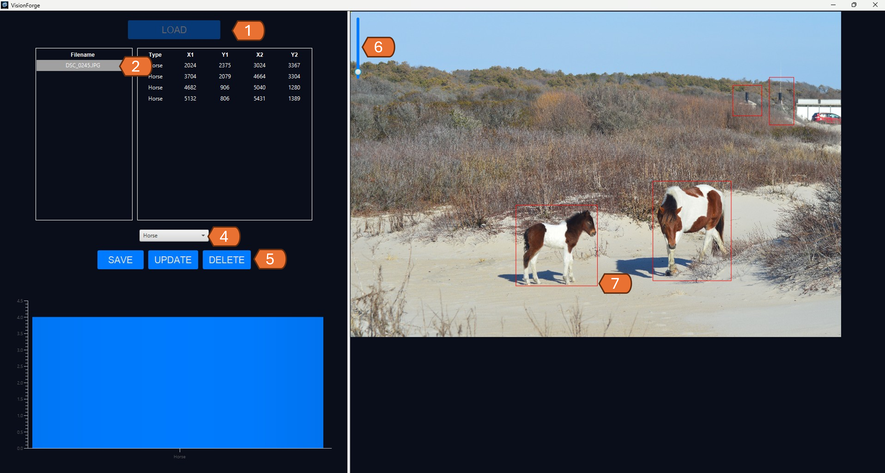
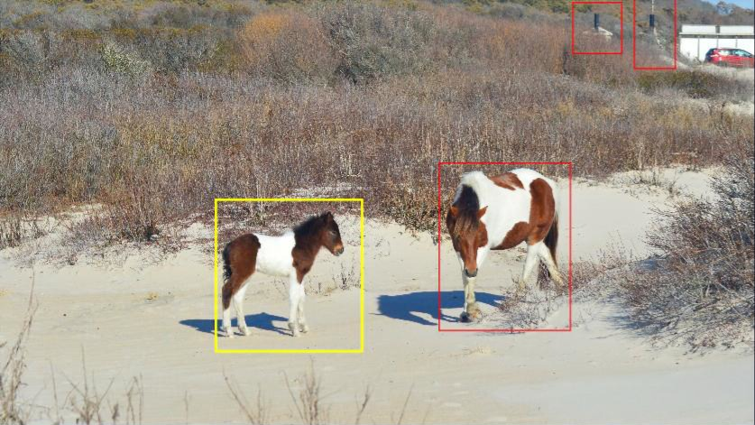

<!-- Improved compatibility of back to top link: See: https://github.com/othneildrew/Best-README-Template/pull/73 -->

<div align="center">
    
    <p align="center">
      An open source project designed to make it faster and easier to generate training datasets for computer vision algorithms.
      <br />
      <br />
      <a href="https://github.com/SWilliams17655/VisionForge/tree/main/src/"><strong>Explore the Code»</strong></a>
      <br />
      <br />
      <a href="https://github.com/SWilliams17655/VisionForge/issues/new?labels=bug&template=bug-report---.md">Report Bug</a>
      ·
      <a href="https://github.com/SWilliams17655/VisionForge/issues/new?labels=enhancement&template=feature-request---.md">Request Feature</a>
    </p>
</div>
<br>
<br>
<summary>Table of Contents</summary>
  <ol>
    <li><a href="#about-the-project">About The Project</a></li>
    <li><a href="#download">Download</a></li>
    <li><a href="#contribute">Contribute</a></li>
  </ol>

<h2 id="about-the-project">About the Project</h2>

<p><u>Problem Statement</u>: Computer vision algorithms for object detection are powerful tools that enhance sensor capability allowing the sensor to detect object within an image as shown in Figure 1. To accomplish this, these algorithms must be trained using large datasets of pre-classified images like the one in Figure 2. Although there are many pre-classified datasets available (COCO, CIFAR, etc.) there are few open source tools available to generate new datasets.</p>
<p><u>Project's Objective</u>: Create an open source tool for users to rapidly generate training datasets for computer vision algorithms using bounding boxes.</p>
<br>
<br>
<h2> Built With </h2>
<div style="display: block">
    
</div>
<br>
<br>
<div align="center">
    
</div>


<h2 id="download">Download Most Recent Version</h2>

<div align="center">
    
</div>

Coming Soon

<h2 id="contribute"> To Contribute </h2>

Contributions are what make the open-source community such an amazing place to learn, inspire, and create. Any contributions you make are **greatly appreciated**.

If you have a suggestion that would make this better, please fork the repo and create a pull request. You can also simply open an issue with the tag "enhancement".
Don't forget to give the project a star! Thanks again!

1. Fork the Project
2. Create your Feature Branch (`git checkout -b feature/AmazingFeature`)
3. Commit your Changes (`git commit -m 'Add some AmazingFeature'`)
4. Push to the Branch (`git push origin feature/AmazingFeature`)
5. Open a Pull Request

<h2 id="how_to"> How To Use </h2>
<h3>Install</h3>
<p>VisionForge is based on the Java Interperative Language. To use the software users must have the most current version of <a href="https://www.oracle.com/java/technologies/downloads/">Java SDK</a>.</p>

<h3>Starting the program</h3>
<p>Once downloaded, VisionForge is wrapped in a .exe file making use very simple. Double click to launch the software and you will be taken to the initial screen shown below.</p>
<div align="center">
    
</div>
<h3>Creating a new training set</h3>
<p>The structure of the training folder is shown below. A .json contains all the bounding boxes; whereas, a sub-folder contains all the training images. Currently the software only support JPEG. Other formats will be added later. If you would prefer to download a empty file folder the first time, it can be downloaded from this link.</p>
<div align="center">
    
</div>
<p>Looking at the .json you will see a format that includes the LABELS. These labels represent a list of the objects that will be in your images. For example; horses, cars, people, etc. Edit this label to include all the objects your training dataset will be expected to classify. Once you load your initial JSON, this list will populate so you can classify images.</p>

```
{"LABELS":["Horse"],
"FEATURES":
    [{"TYPE_ID":1,
    "IMAGE_ID":"DSC_0245.JPG",
    "BBOX":[2024,2375,3024,3367]},
    
    {"TYPE_ID":1,
    "IMAGE_ID":"DSC_0245.JPG",
    "BBOX":[3704,2079,4664,3304]}
    ]}
```

<p>With the training folder created, you can now go back to the VisionForge software and click the Load button. Navigate to your JSON and select it. From there your training dataset will load.</p>

<h3>Labeling Data</h3>
<p>VisionForge uses BoundingBoxes to label image. Start by selecting your image in the image box. This will open your image on the right side.
Resize the image as required.</p>

<p>Find the object you would like to classify and click in the upper left side dragging the bounding box to the lower right.</p>
<div align="center">
    
</div>

<p>Select the object classification from the dropdown (Figure 2, Number 6).</p>
<p>Click save (Figure 2, Number 5). Each time save is clicked the dataset JSON is updated.</p>

<h3>Deleting Classification</h3>
<p>If an object is not correctly marked, a user can select it from the list on the left then click the delete button. (Figure 2, Number 2)</p>

<h3>Updating Classification</h3>
<p>If an object is incorrectly classified, the user can select it from teh list on the left (Figure 2, Number 6) then change the object classification in the drop-down (Figure 2, Number 4).
Finally, click the update button. (Figure 2, Number 5)</p>
