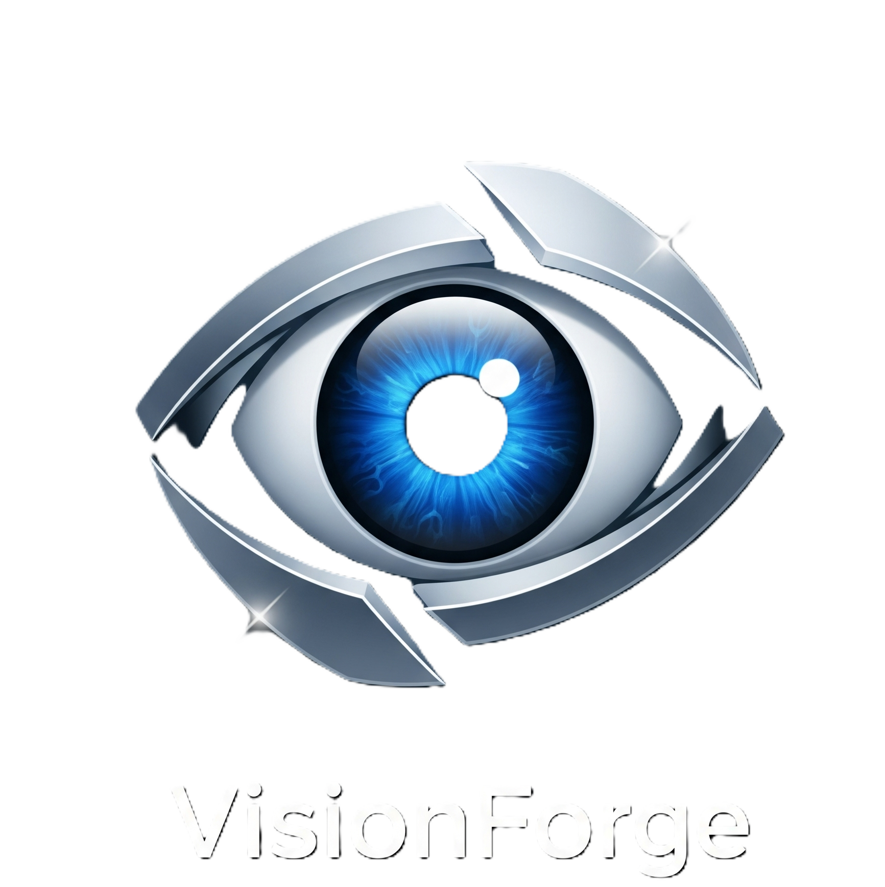
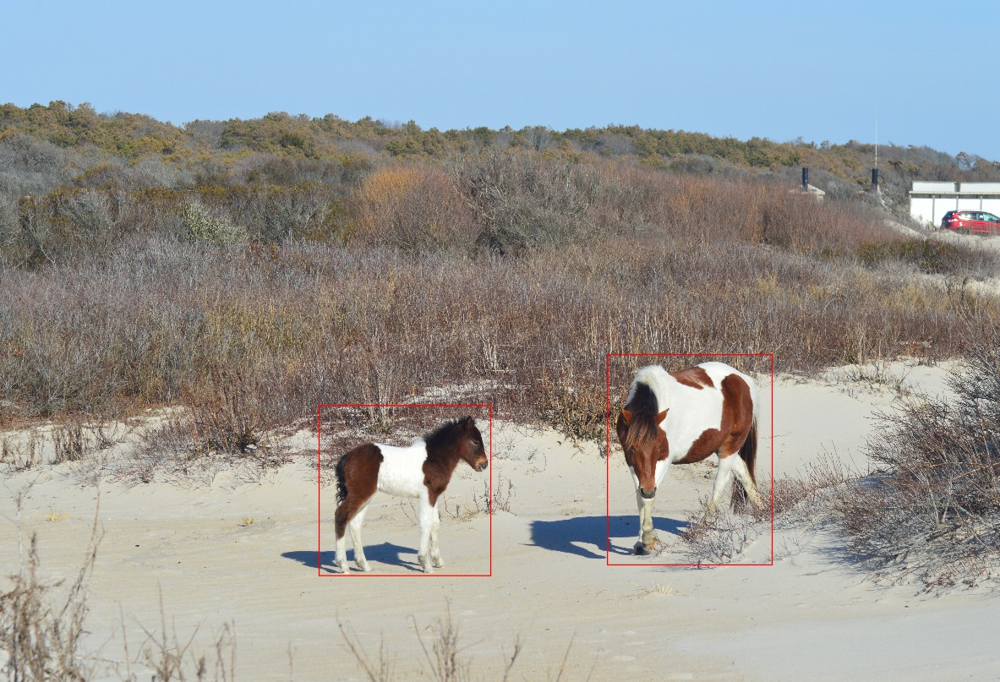

<!-- Improved compatibility of back to top link: See: https://github.com/othneildrew/Best-README-Template/pull/73 -->

    
    

      An open source project designed to make it faster and easier to generate training datasets for computer vision algorithms.
       
       
      <a href="https://github.com/SWilliams17655/VisionForge/tree/main/src/"><strong>Explore the Code»</strong></a>
       
       
      <a href="https://github.com/SWilliams17655/VisionForge/issues/new?labels=bug&template=bug-report---.md">Report Bug</a>
      ·
      <a href="https://github.com/SWilliams17655/VisionForge/issues/new?labels=enhancement&template=feature-request---.md">Request Feature</a>
    

 
 

Table of Contents

  <ol>
    <li><a href="#about-the-project">About The Project</a></li>
    <li><a href="#download">Download</a></li>
    <li><a href="#contribute">Contribute</a></li>
  </ol>

<h2 id="about-the-project">About the Project</h2>

<u>Problem Statement</u>: Computer vision algorithms for object detection are powerful tools that enhance sensor capability allowing the sensor to detect object within an image as shown in Figure 1. To accomplish this, these algorithms must be trained using large datasets of pre-classified images like the one in Figure 2. Although there are many pre-classified datasets available (COCO, CIFAR, etc.) there are few open source tools available to generate new datasets.

<u>Project's Objective</u>: Create an open source tool for users to rapidly generate training datasets for computer vision algorithms using bounding boxes.

 
 

    

<h2> Built With </h2>

    

<h2 id="download">Download Most Recent Version</h2>

Coming Soon

<h2 id="contribute"> To Contribute </h2>

Contributions are what make the open-source community such an amazing place to learn, inspire, and create. Any contributions you make are **greatly appreciated**.

If you have a suggestion that would make this better, please fork the repo and create a pull request. You can also simply open an issue with the tag "enhancement".
Don't forget to give the project a star! Thanks again!

1. Fork the Project
2. Create your Feature Branch (`git checkout -b feature/AmazingFeature`)
3. Commit your Changes (`git commit -m 'Add some AmazingFeature'`)
4. Push to the Branch (`git push origin feature/AmazingFeature`)
5. Open a Pull Request

